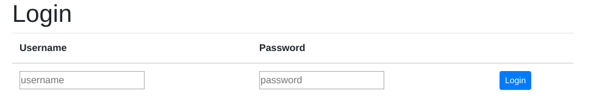

# Table of Contents
1. [Aufgabenstellung](#Aufgabenstellung)
2. [OrdnerStruktur](#OrdnerStruktur)
2. [Implementierung](#Implementierung)
    1. [Server](#Server)
        1. [Requirements](#Requirements)
        2. [ServerStarten](#ServerStarten)
        3. [Erklärung](#CodeErklärung)
        4. [CMDBefehle](#Befehle)
        5. [Persistierung](#Persistierung)
        6. [Base-64Encoder](#Encoder)
    2. [Clients](#Clients)
        1. [VUEJs](#VUEJs)
        2. [JavaFX](#Java)
    3.  [Authentifizierung](#Authentifizierung)
        1.  [Flask](#FlaskAuth)
            1. [HTTPBasicAuth](#HTTPBasicAuth)
            2.  [Passwort](#Passwort)
            3.  [Admin](#Admin)
        2.  [Vue](#Vue)
            1.  [Login](#Login)
            2.  [axios](#axios)
3.  [Deployment](#Deployment)
    1.  [Heroku](#Heroku)
        1.  [Implementierung](#Implementierung)
            1.  [Flask](#FlaskDeployment)
3. [Quellen](#Quellen)
## Aufgabenstellung
Die detaillierte [Aufgabenstellung](TASK.md) beschreibt die notwendigen Schritte zur Realisierung.

## CI Status
CI | Build status | config file | Tests
:--- | :--- | :--- | :---
Travis |  [](https://travis-ci.com/eecevit-tgm/sew5-simple-user-database-eecevit-tgm)| [.travis.yml](.travis.yml) | [pyTests](src/unittest/python/GK/test_read.py) / [Cypress](src/main/vue/cypress/integration/tests.js)

## OrdnerStruktur


```bash
├── sew5-simple-user-database-eecevit-tgm/
│   ├── docs
│   #wird nicht weiter verwendet
│
├── restful_userservice.egg-info
│   #wird nicht weiter verwendet
│   
├── src
│   ├── main
│   #in diesem Folder befindet sich der source code
│   │   ├── java
│   │   #java UI ohne Gradle
│   │   ├── java_gradle
│   │   #java UI mit Gradle
│   │   ├── python
│   │   #python Server
│   │   ├── vue
│   │   #vue client
│   ├── unittest
│   #in diesm Folder befinden sich die Tests
├── tox.ini
│   #für das automatisierte Testen
├── requiremets 
│   #beinhalten die Anfroderungen für das Tox - File
├── .travis.yml
│   #Travis file, damit Travis die Test durchführen kann
├── .gitignore
```

## Implementierung

## Server

### Requirements

* Implementierung
    * [Flask](#Flask)
    * [Python](#Python)
* Testing
    * [Tox](#Tox)
    * [PyTest](#)

#### Flask
Es wurde hierbei Flask verwendet, da es mit sehr wenig code, ein einfacher Server erstellt werden kann. Ebenso können alle HTTP Requests genau geroutet werden. Ebenso kann eingestellt werden, ob bei einem Request ein Parameter mitgeliefert werden soll. 

**Flask**
* bietet eine einfache REST Schnittstelle
* einfaches routen
* return kann beliebieg definiert werden

#### ServerStarten
Der Server kann mit dem Befehl aus dem Hauptfolder gestartet werden
```bash
python src/main/python/server/server.py
```
Bei einem erfolgreichen Start sollte folgende Ausgabe kommen
```bash
 * Serving Flask app "server" (lazy loading)
 * Environment: production
   WARNING: Do not use the development server in a production environment.
   Use a production WSGI server instead.
 * Debug mode: on
 * Running on http://127.0.0.1:5000/ (Press CTRL+C to quit)
 * Restarting with stat
 * Debugger is active!
 * Debugger PIN: 276-721-881
```
Wenn es zu einer Fehlermeldung kommt, könnte es sein, dass der Port schon blockiert ist.
Um die IP-Adresse oder den Port ändern zu können muss im Code etwas bearbeitet werden. 
Hierführ muss in das Dokument [server.py](src/main/python/server/server.py) im Verzeichnis ```src/main/python/server/```

Dort muss auf Zeile 223 muss folgender Code hinzugefügt werden ```host="...",port="..."```.   
```python
if __name__ == '__main__':                  if __name__ == '__main__':
    app.run(debug=True)                             app.run(debug=True,host="0.0.0.0",port="5005")
```
#### CodeErklärung
Der Coder wurde im File genau beschrieben und kommentiert. [server.py](src/main/python/server/server.py)


### Befehle
Es können nun folgende Befehle über die CMD ausgeführt werden
```bash
curl http://localhost:5000/user
# listet alle User

curl http://localhost:5000/user/<username>
#listet einen bestimmten User

curl http://localhost:5000/user/<username> -X DELETE -v
#löscht einen bestimmten User

curl http://localhost:5000/user/<username> -d "username=newName" -d "email=mail@mail.com" -d "picture=eecevit.jpg" -X PUT -v
#ändert die Werte zu einem bestimmten User

curl http://localhost:5000/user -d "username=newName" -d"email=mail@mail.com" -d"picture=eecevit.jpg" -X POST -v
#erstellt einen neuen User
```
### Persistierung
Damit alles Persistiert werden kann, wurde ein [user.json](src/main/python/server/user.json) File erstell. Hier werden alle User in einem JSON-Format abgespeichert.\
Um CRUD Befehle auf die User im [user.json](src/main/python/server/user.json) ausführen zu können wurde das File [jreader.py](src/main/python/server/jreader.py) erstellt.

### Encoder
Damit uUser auch ein Profilbild haben können, wurde eine Encoder [encoder.py](src/main/python/server/encoder.py) geschrieben, welcher ein Bild in base64 encoded.

## Client

### VUEJs
Es wurde VUEJs verwendet, da dieser einen sehr guten DOM - Support hat und die Objekte dynamisch erstellt, befüllt und bearbeitet werden können. 

Hierbei wurde ```npm``` verwendet. 
Um die fehlenden Packe nachinstallieren zu können, muss als erstes in den [vue](src/main/vue/) Ordner gewächselt werden. Dort mit dem Befehl.
```bash
npm install
```
werden alle erfordeten NodeJS Packete installiert. 
##### Server mit NPM Starten
Damit nicht wieder zurück navigiert werden muss, wurde ein Command in [package.json](src/main/vue/package.json) erstellt. Um den Server zu starten muss folgendes eingegeben werden.
```bash
npm run server
```

Um nun den Client zu starten muss der Befehl
```bash
npm run dev
```
ausgeführt werden, dann sollten alles laden. Wenn alles richtig geladen wurde, kommt folgende Meldung.
```bash
 DONE  Compiled successfully in 2865ms                                   03:20:11

 Your application is running here: http://localhost:8080
```
#### Port ändern
Um die Port adresse für VUEJs zu ändern muss im [index.js](src/main/vue/config/index.js) File auf der Zeile 17 die Port Nummer geändert werden
```js
    port: 8080              ==>                   port:4034
```
oder über die CLI mit dem Befehl

#### Cypress.ioTesting
Cypress ist ein simpler UI Tester, welcher nach Elementen sucht und mit denen dann interagiert. 

Um die UI Testen zu können, wurde Cypress verwendet. 
Um Cypress zu starten
```bash
npm run cy:open
```
Da öffnet sich ein Fenster, dort kann man das File [test.js](src/main/vue/cypress/integration/tests.js) ausführen. 

### Java
### UI
Es wurde ein weiterer Desktop Client geschrieben.
Dieser wurde in [JavaFX](#JavaFx) mittels  [SceneBuilder](#SceneBuilder) erstellt.

### Implementierung
Die Verbindung auf die RestSchnittstelle wurde im [Connection.java](src/main/java/src/Connection.java) deklariert. Für die Requestst wurde das [java.net](https://docs.oracle.com/javase/8/docs/api/java/net/HttpURLConnection.html) Package verwendet. 

Um die Requests Parsen zu können wurde ein eigener [Parser](src/main/java/src/Parser.java) geschrieben. Dieser verwedet [org.simple.json](http://alex-public-doc.s3.amazonaws.com/json_simple-1.1/index.html) Package. 

### FirstDeployment

      
**NOTE**: [PythonServer](src/main/python/server/server.py) muss schon im Hintergrund laufen.
Zuerst muss in den [java](src/main/java) Ordner navigiert werden. 
```bash
cd src/main/java
```

#### Gradle
Bei Gradle gibt es leider noch einige Errors. Die möglichen Befehle wären:
```bash
gradle build

gradle run
```
#### JavaCMD
man kann auch mit zwei einfachen Befehlen das Programm ausführen
```bash
javac src/WindowStarter.java
```
Dann wird das Class - File gebildetet, dannach kann mit
```bash
java src/WindowStarter
```
Der Client gestartet werden. 

##### Ausstehend
[] Gradle verfollständigen

[] Java Tests

[] Java UI Update

## Authentifizierung
### FlaskAuth
#### HTTPBasicAuth
Um eine Authentifizierung bei Flask durchführen zu können, wurde die Annotation
`@auth.login_required`
verwendet. Um diese Annotation verwenden zu können, muss das Modul `HTTPBasicAuth` von `flask_httpauth` importiert werden.

Wenn vor jeder Methode, diese Annotation geschrieben wird, wird immer eine Authentifizierung erwartet, wenn diese nicht vorhanden ist, 
kann die Methode nicht ausgeführt werden.

Bei der Implementierung sieht wie folgt aus:
```python
@auth.login_required
    def get(self, username):
        return USERS
```
Jedoch muss davor noch festgelegt werden, wie sich der User verifizieren kann. Hierführ muss mit der
Annotation `@auth.verify_password` eine Methode definiert werden, welches `True` oder `False` zurückgibt.

Dies würde wie folgt aussehen:
```python
@auth.verify_password
def verify(username, password):
    if not (username and password):
        return False
    for user in USERS:
        if user['username'] == username:
            if verify_password(password, username):
                checkAdmin(username)
                return True
```
Hierbei wird überprüft, ob der User, der sich verifizieren will existiert, dannach ob das Passwort des Users
korrekt eingegeben wurde.

#### Passwort
Damit die Passwörter nicht ersichtlich sind, werden diese in `sha256` gehased und abgespeichert. Hierbei wurde 
das Modul `haslib` verwendet. 

Das Hashen der Passwörter ist wie folgt:
```python
def hash_password(password):
    pw_hash = hashlib.sha256(password.encode('utf-8'))
    dig = pw_hash.hexdigest()
    return dig
```
Bei dieser Methode, wird das Passwort in plain eingebenen, dieser Hased das Ganze und gibt es als
`sha256` wieder zurück. 

#### Admin
Es soll nicht jeder Benutzer in der Lage sein, die Datenbank nach belieben zu ändern. Daher wurde jdem User
ein weiterer Tag `admin` hinzugefügt. Wenn dieser `True` gesetzt ist, kann dieser User vorhande User Löschen und Updaten
und neue User anlegen. 

Die Überprüfung erfogt mit:
```python
def checkAdmin(username):
    pos = abort_if_user_doesnt_exist(username)
    if USERS[pos]['admin'] == "true":
        return True
    else:
       return False
``` 
Hierbei wird ein username verlang, dann wird überpüft ob der Benutzer existiert. Wenn dieser existiert, 
dann wird überprüft, ob dieser `admin` rechte hat. 

### Vue
Da nun bei `Flask` eine Authentifizierung erfordert wird, kann nicht mehr wie vorher beliebig ein 
`pul || push || delete` Befehl ausgeführt werden. 
#### Login
Daher wird ein Login benötigt. 


Dieser speichert den `Usernamen` und das `Passwort`, dannach können wieder wie vorher `pul || push || delete` Befehl ausgeführt werden.

#### axios
Bei Axios gibt es die Möglichkeit, eine Authentifizierung mitzusenden. Hierbei muss nach der URL
der Befehl,
```vue
auth: {
          username: username,
          password: password,
        },
```
beigefügt werden.

Hierbei wird der gespeicherte `Username` und das gespeicherte `Passwort` mitgesendet. 

# Deployment
## Heroku
Damit jeder die Software verwenden kann, wurde diese auf [Heroku](https://www.heroku.com/) geladen.

Als erstes muss die [Heroku - CLI](https://devcenter.heroku.com/articles/getting-started-with-python#set-up) heruntergeladen und installiert werden. 
Dannach muss mit dem Befehl:
```bash
heroku login
```
Muss sich der User verifizieren. 
### Implementierung
#### FlaskDeployment
Als erstes gehen wir durch, wie ein `Python FLASK` Applikation auf [Heroku](https://www.heroku.com/) 
deplyed werden kann.

1. git initalisieren 
    ```bash
    git init
    ```
2. Heroku create
    Dannch mit dem Befehl 
    ```bash
    heroku create eecevit-flask
    ```
    wobei statt `eecevit-flask` soll der beliebige Projektname eingefügt werden. 
3. requirements
    Damit Heroku die `Flask` Applikation richtig ausführen kann, muss ein [requirments.txt](src/main/python/server/requirements.txt) erstellt werden, wleches alle Dependencies beinhaltet.
    Damit nicht alle manuell eingegeben werden müssen, kann mit dem Befehl:
    ```bash
    pip freeze > requirements.txt
    ```
    alles gleich abgespeichert werden. 
4.  git mit heroku verbinden
    Um die Applikation auf Heroku sichtbar zu machen, muss folgender Befehl ausgeführt werden:
    ```bash
    heroku git:remote --app eecevit-flask
    ```
    Wobei hierbei wieder geachtet werden muss, dass der Projektname von vorher eingegeben werden muss.
5.  Deployen
    Dannach kann `git add . && git commit -a -m "Deploy Applikation." && git push heroku master`
    
    Wenn alles erfolgreich war, wird deine Applikation auf `https://<Projekt-Name>.herokuapp.com` zugänglich sein.
    [https://eecevit-flask.herokuapp.com](https://eecevit-flask.herokuapp.com)
# Quellen
#### [Python](https://docs.python.org/3/)

#### [Flask](http://flask.pocoo.org/docs/1.0/quickstart/)

#### [Flask-Restful](https://flask-restful.readthedocs.io/en/latest/quickstart.html)

#### [Sphinx](http://www.sphinx-doc.org/en/master/)

#### [Tox](https://tox.readthedocs.io/en/latest/)

#### [JavaFX](https://wiki.openjdk.java.net/display/OpenJFX/Main)

#### [SceneBuilder](https://www.oracle.com/technetwork/java/javase/downloads/javafxscenebuilder-info-2157684.html)

#### [Cypress](https://www.cypress.io/)


